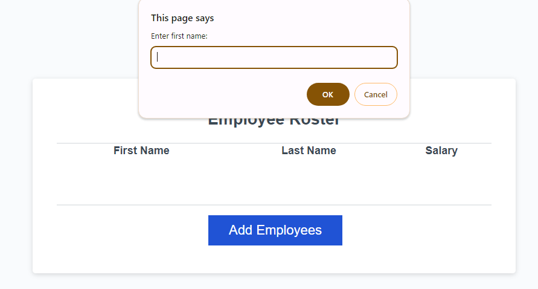
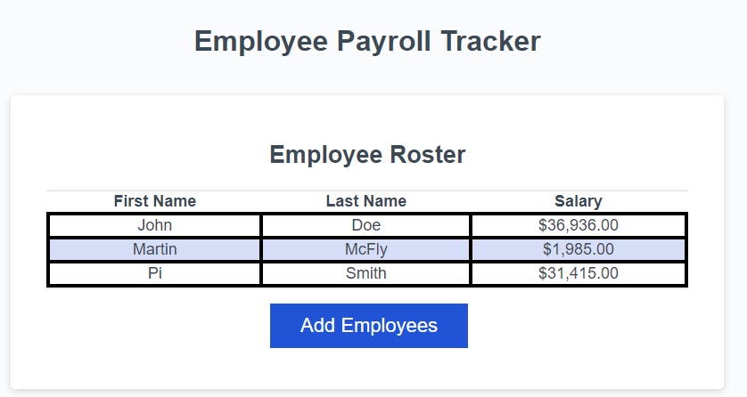

# Employee Payroll Tracker

## Description

This application allows a user to input information for multiple employees.  Specifically, a user can enter the employee's first and last name as well as their salary.  Once entered, the user can view the entered information in a chart sorted alphabetically by last name.  Furthermore, the application will calculate the average salary for all employees whose information is entered into the system and display that figure.  Also, the application will pick one employee at random who will be designated the winner of the random drawing and display a congratulatory message to that employee.

As a student, this was a chance for me to further develop some of the pre-existing code to help me further my knowledge and experience with JavaScript.  There were a number of commands that I researched that were not covered during the week of April 22, 2024.  These commands helped me to achieve a final product.  Among these commands were: 
    -the "while" loop
    -the "prompt" method
    -the "isNAN" function
    -the "Number" constructor
    -the "confirm" method
    -the "toFixed" method
    -the "MATH.floor" method
    -the "MATH.Random" method

These commands, coupled with the commands we learned during the week have broadened my JavaScript abilities and I look forward to learning more!

## Installation

N/A

## Usage

Anyone with the link to the application (<a href="https://orian42.github.io/payroll/">https://orian42.github.io/payroll/</a>) may use it.  It should be noted that this is a student project and should not be regarded as a real-world tool.

Begin use by clicking the "Add Employees" button and filling out the information as prompted.  Note: the salary should be entered as a number.  At the end of entering the information, a confirmation will be displayed asking if the user wants to add an additional employee.  The user should click "OK" to add another employee or "Cancel" to conclude that data input.

## Credits

No other person aided in my additions to the pre-existing code.  The pre-existing code was provided by my instructors.

Research into additional commands was conducted using multiple websites too numerous to name.

## License

Please refer to the LICENSE in the repo.